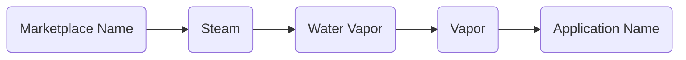

# Vapor

## What is this for?
The Steam marketplace is more crowded and competitive than ever. 
Every day, thousands of new games are released, and it's getting harder for new titles to find an audience. 
For game developers, especially indies and small studios, this can feel like an impossible challenge.

This is where our application comes in.

Our tool provides the data and insights you need to make informed, strategic decisions at every stage of your game's lifecycle.
We go beyond simple stats to give you a clear understanding of the market, helping you answer critical questions like:

- What genres and tags are on the rise?

- What pricing strategy works best?

- How do I get noticed?

- What features should I prioritize?

## How did I come up with this awesome project name?

Spoiler warning

